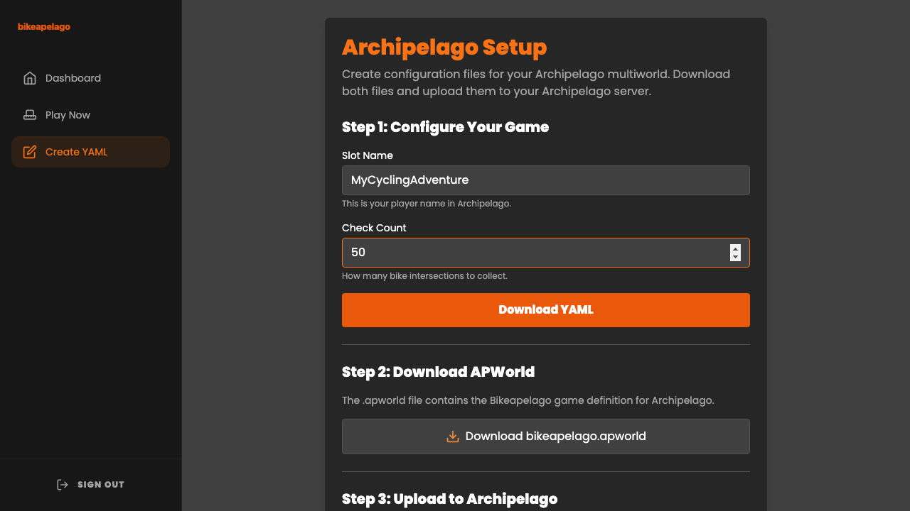
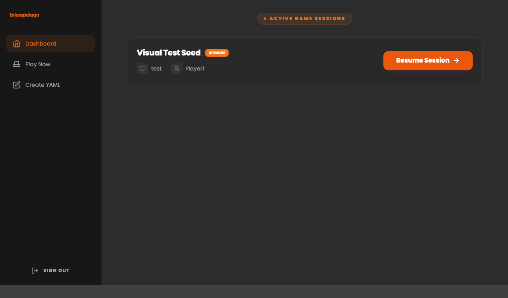
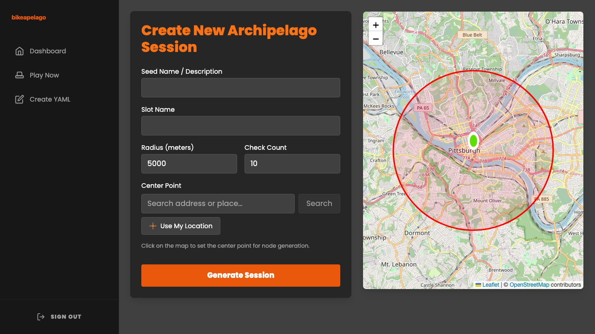
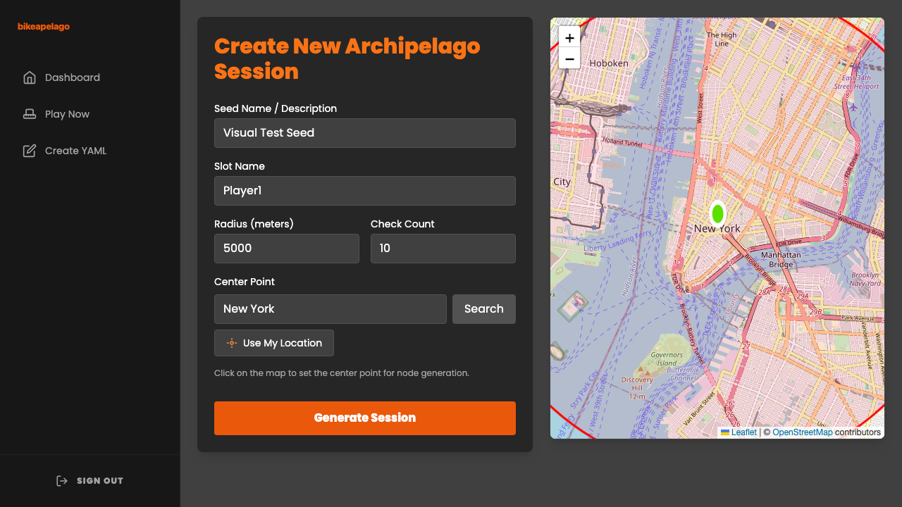
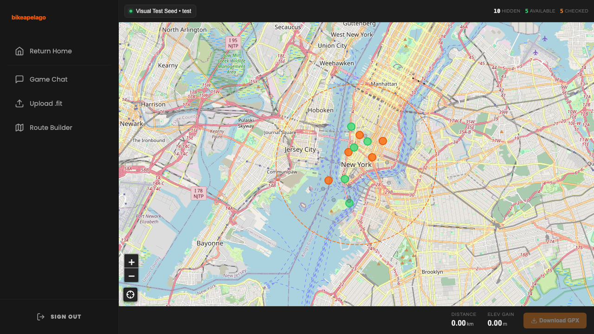
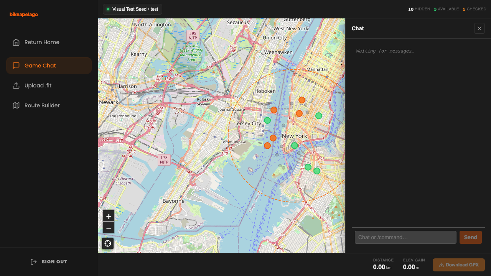
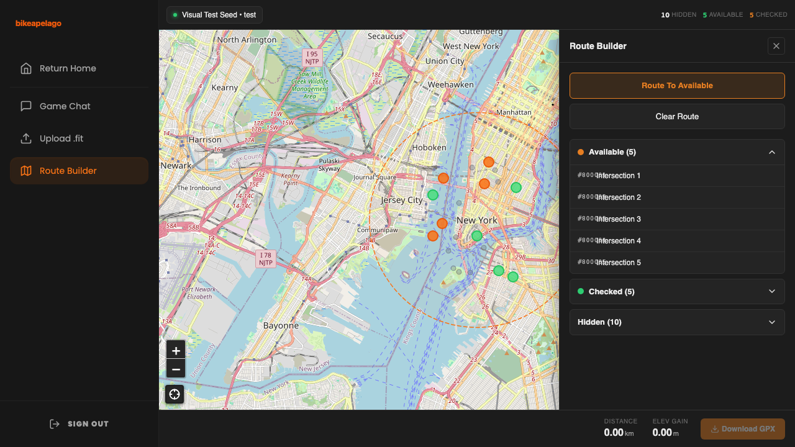
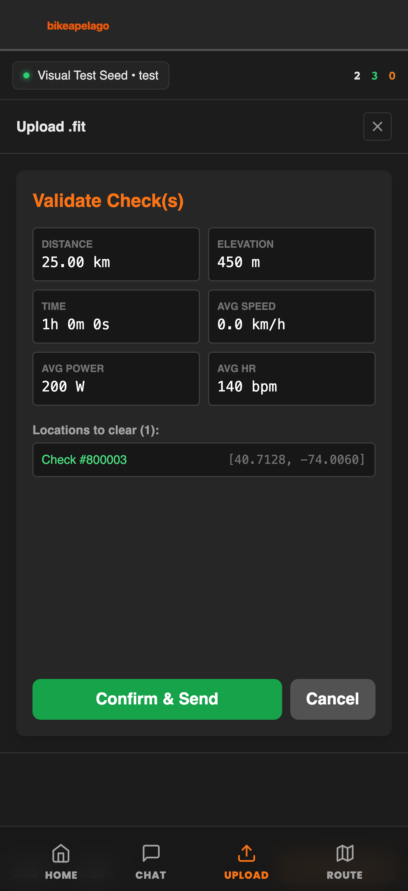
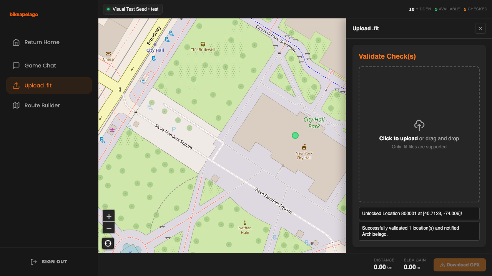

# 🚲 Bikeapelago

**The real-world cycling client for [Archipelago](https://archipelago.gg).**

Bikeapelago allows you to randomly generate cycling routes in a radius around your area

---

## 🕹️ The Experience

### 0. Setup Your Game
Use the **Archipelago Setup** tool to generate your YAML configuration and download the `.apworld` game definition. Upload these to your Archipelago server to start your multiworld.
<p align="center">
  
</p>

### 1. Launch Your Dashboard
It's a dashboard! Here's where you can see in-progress games or interact with the sidebar. 
<p align="center">
  
</p>

### 2. Generate a New World
Once you've sent your YAML file and apworld off to the archipelago session host (or set up the session yourself), you'll actually connect and generate the session.  Pick a point on the map to act as your home base and a radius of how far you're willing to travel. 
<p align="center">
  
  
</p>

### 3. Connect to the Multiworld
Link your session to an Archipelago server. As you or your teammates find "Node Unlock" items in other games, new pins will appear on your map in real-time.
<p align="center">
  
</p>

### 4. Communicate & Coordinate
Shitpost in chat, or check out item notifications. 
<p align="center">
  
</p>

### 5. Plan Your Route
Use the built-in **Route Builder** (powered by a self-hosted GraphHopper engine) to plan the most efficient path through your available checks. Export the path as a GPX file directly to your Garmin or Wahoo head unit, or to any other fitness tracking app.
<p align="center">
  
</p>

### 6. Validate Your Ride
After your ride, drag and drop your `.fit` activity file. Review your ride stats—including distance, elevation, power, and heart rate—and see which Archipelago locations will be cleared. Upon confirmation, the app notifies the server and reveals new locations on your map.
<p align="center">
  
  
</p>


---

## 🛠️ Infrastructure

Bikeapelago is designed to be self-hosted and includes everything you need in a single `docker-compose.yml`:

| Service | Component | Port |
| :--- | :--- | :--- |
| **bikeapelago** | SvelteKit Frontend + PocketBase DB | `8182` |
| **archipelago** | Seed Generation & Server Host | `38281` |
| **graphhopper** | Cycling-optimized Routing Engine | `8990` |

### Quick Start
1.  **Clone & Data**: `git clone <repo>` and place a `.osm.pbf` map file in `./graphhopper/data/`.
2.  **Launch**: Run `docker compose up -d`.
3.  **Play**: Access the UI at `http://localhost:8182`.

---

## 🔧 Development

The project uses **Playwright** for E2E testing and visual regression. To run tests and generate fresh screenshots:

```bash
cd bikeapelago-src
npm install
npx playwright test --project=chromium
```

For detailed technical setup and architecture, see [bikeapelago-src/README.md](bikeapelago-src/README.md).

---

## 📜 License
MIT
