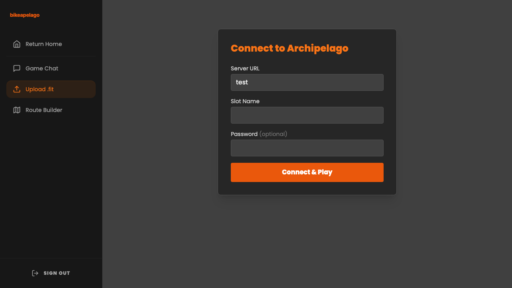
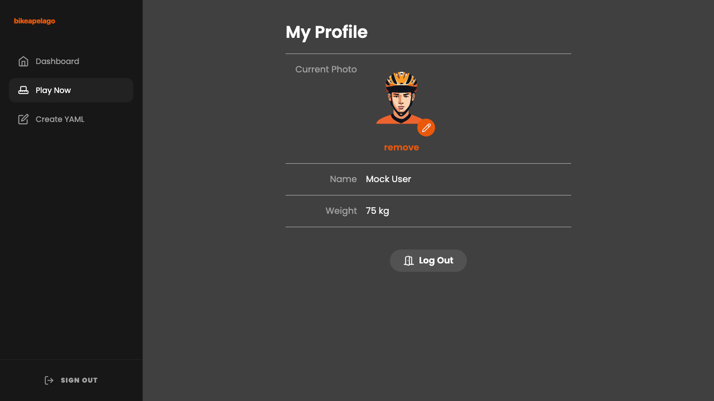

# 🚲 Bikeapelago

**The real-world cycling client for [Archipelago](https://archipelago.gg).**

Bikeapelago transforms your local cycling routes into an interactive "Multiworld" game. By connecting real-world OpenStreetMap data with the Archipelago randomizer, it turns every intersection into a potential location to check and every ride into a quest.

---

## 🕹️ The Experience

### 1. Launch Your Dashboard
Start from your personal dashboard where you can see your active sessions, recent activities, and overall progress.
<p align="center">
  
</p>

### 2. Generate a New World
Define your play area by searching for a center point and setting a radius. The app automatically fetches cycling-specific intersections (excluding major highways) to create your unique map of locations.
<p align="center">
  
  
</p>

### 3. Connect to the Multiworld
Link your session to an Archipelago server. As you or your teammates find "Node Unlock" items in other games (like Zelda or Link to the Past), new intersections will appear on your map in real-time.
<p align="center">
  
</p>

### 4. Communicate & Coordinate
Stay in touch with your multiworld partners using the integrated chat client. See item notifications and coordinate your next big ride.
<p align="center">
  
</p>

### 5. Plan Your Route
Use the built-in **Route Builder** (powered by a self-hosted GraphHopper engine) to plan the most efficient path through your available checks. Export the path as a GPX file directly to your Garmin or Wahoo head unit.
<p align="center">
  
</p>

### 6. Validate Your Ride
After your ride, drag and drop your `.fit` activity file. The app analyzes your GPS track and automatically completes checks for every intersection you successfully reached (within a 30m tolerance).
<p align="center">
  
</p>

### 7. Track Your Progress
View your historical routes, elevation profiles, and overall "Athlete" stats as you work toward your goal.
<p align="center">
  
</p>

---

## 🛠️ Infrastructure

Bikeapelago is designed to be self-hosted and includes everything you need in a single `docker-compose.yml`:

| Service | Component | Port |
| :--- | :--- | :--- |
| **bikeapelago** | SvelteKit Frontend + PocketBase DB | `8182` |
| **archipelago** | Seed Generation & Server Host | `38281` |
| **graphhopper** | Cycling-optimized Routing Engine | `8990` |

### Quick Start
1.  **Clone & Data**: `git clone <repo>` and place a `.osm.pbf` map file in `./graphhopper/data/`.
2.  **Launch**: Run `docker compose up -d`.
3.  **Play**: Access the UI at `http://localhost:8182`.

---

## 🔧 Development

The project uses **Playwright** for E2E testing and visual regression. To run tests and generate fresh screenshots:

```bash
cd bikeapelago-src
npm install
npx playwright test --project=chromium
```

For detailed technical setup and architecture, see [bikeapelago-src/README.md](bikeapelago-src/README.md).

---

## 📜 License
MIT – Play hard, ride safe.
